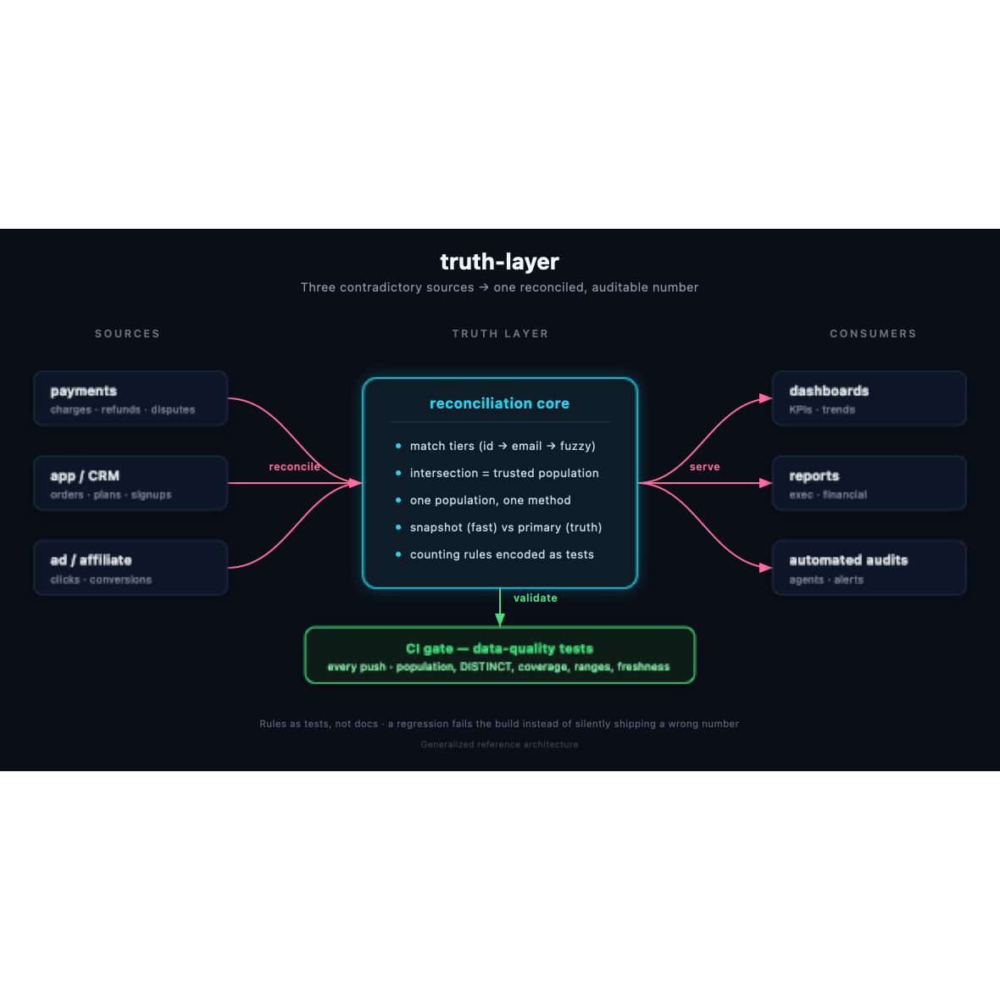

# truth-layer

[](https://github.com/avrahamluna/truth-layer/actions/workflows/ci.yml)
[](LICENSE)

A **single source of truth** layer for businesses whose data lives across
multiple systems (a payments processor, an internal app/CRM, an ad/affiliate
platform) and who no longer trust their own numbers.

> Generalized from a production system I designed and operated (2025–2026) that
> unified 3+ data sources into one reconciled, auditable layer.

---

## The problem

Most companies with real traction already have data. What they *don't* have is
**one place they can trust**. The same question ("how many customers do we
have?") returns three different answers depending on who runs the query and
which table they hit.

Typical failure modes (all real, all seen in production):

- **Population mixing** — tab 1 counts sessions, tab 2 counts leads, tab 3
  counts paid customers. The numbers aren't comparable, but they're shown
  side by side.
- **`COUNT(*)` instead of `COUNT(DISTINCT ...)`** — transactions counted as
  people. A customer with 3 renewals counts as 3.
- **Snapshot treated as source of truth** — an aggregate snapshot is fast but
  lags reality; using it to answer "does this customer exist?" produces false
  negatives that cost money.

## Case studies (why this matters)

Real problems this methodology caught in production — anonymized, numbers
rounded, no customer data. These are the kind of errors the tests in this repo
exist to prevent.

### 1. Population mixing inflated a count ~4.5x
A report counted **18,869** "at-risk customers" — the real number was **4,172**.
Cause: one tab counted rows from a table with duplicates per customer instead of
`COUNT(DISTINCT customer_id)`. The single-population CTE + the
`category_totals_never_exceed_population` test would have failed the build.

### 2. Margin reported 64%, actual was 43%
A P&L showed a **64%** gross margin. The real figure was **43%** — a 21-point
gap. Cause: cost of goods was applied as a flat rate instead of the real
per-order cost. Lesson: a number that flatters you is the one to attack first.

### 3. A ~$46K "phantom gap" that didn't exist
Reconciliation flagged ~**$46K** owed that looked like a real discrepancy. It
wasn't: the check queried an aggregate *snapshot* that lagged the cutoff and
omitted the newest records, so present-but-recent items read as "missing."
Fix: existence questions must hit the live primary source (see
`docs/DATA_CONTRACT.md`, Rule #0).

> The pattern across all three: the bug isn't in the SQL syntax — it's in the
> **definition**. What are we counting, from where, with what filter. This repo
> encodes those definitions as rules and enforces them as tests.

## The approach

1. **Contract first** (`docs/DATA_CONTRACT.md`) — one document that says which
   table answers which question, and which questions *must* hit the live
   primary source instead of the snapshot.
2. **One population, one method, whole report** (`docs/COUNTING_RULES.md`) —
   define the population in a single CTE and reuse it everywhere.
3. **Tests that enforce the rules** (`tests/`) — "no customer counted twice",
   "category totals never exceed the population", "populations never mixed".
4. **CI that runs the tests on every push** (`.github/workflows/ci.yml`) — the
   truth layer audits itself.
5. **Red-team every material number before it ships** (`docs/RED_TEAM.md`) — a
   repeatable skeptic's method (right field, two sources, row-level, hostile
   adversary pass) so a wrong number gets caught *before* leadership sees it,
   not after.

## Architecture



Three contradictory sources go in; one reconciled, contract-governed layer
comes out, and its data-quality tests run in CI on every push. See
`docs/ARCHITECTURE.md` for the reasoning behind each decision.

## Layout

| Path | What |
|------|------|
| `docs/DATA_CONTRACT.md` | Which source answers which question (snapshot vs primary) |
| `docs/COUNTING_RULES.md` | How to count people without double-counting or mixing populations |
| `docs/ARCHITECTURE.md`   | System diagram and design decisions |
| `docs/RED_TEAM.md`       | How to break your own number before someone else does |
| `models/`                | Example SQL models |
| `tests/`                 | Data-quality tests that enforce the rules |
| `.github/workflows/`     | CI that runs the tests on every push |

## Quick start

```bash
pip install -r requirements.txt
python scripts/build_sample_db.py   # generate a small demo database
pytest -q                          # run the data-quality tests
```

Expected output:

```
....                                                          [100%]
4 passed in 0.03s
```

The tests encode the counting rules as executable checks — if a query violates
"one population, one method" or double-counts customers, the build fails.

## What this demonstrates

- **Data contracts** — a single document that governs which source answers which
  question, and when to trust the primary source over a snapshot.
- **Reconciliation across systems** — unifying payments, app/CRM, and affiliate
  data into one auditable population instead of three contradictory counts.
- **Data-quality testing** — rules encoded as `pytest` checks, not tribal
  knowledge, so definitions are enforced instead of assumed.
- **CI/CD for data** — every push runs the checks; the truth layer audits itself.
- **Analytical rigor** — a repeatable red-team method to break a number before
  it reaches a decision-maker.

## Note on data

This repo demonstrates the *methodology* and *engineering practices* of a real
production system.
